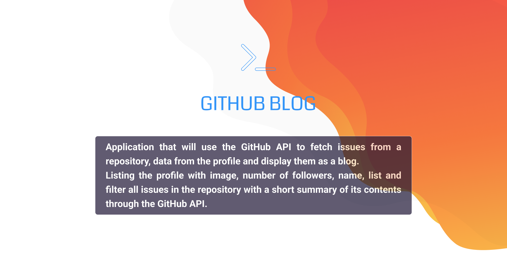
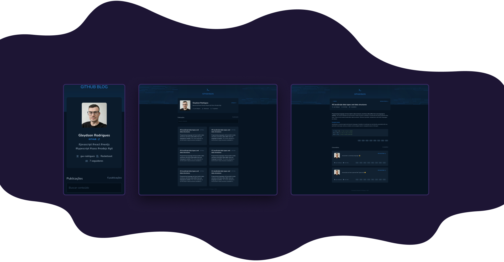

<br/><br/>

[](./LICENSE)


<br/><br/>

<h2 align="center">🛠 Installation</h2>

<br/>

You can use [git](https://git-scm.com) or a tool like [degit](https://github.com/Rich-Harris/degit) to clone my projects for your directory.

```sh
#clone project repository
git clone HTTTPS-or-SSH-URL
#OR
npx degit gw-rodrigues/repository-name new-project-folder-name

#go to project folder
cd new-project-folder-name

#install dependencies
npm install
#OR
yarn

#start project developer mode
npm run dev
#OR
yarn dev
```
